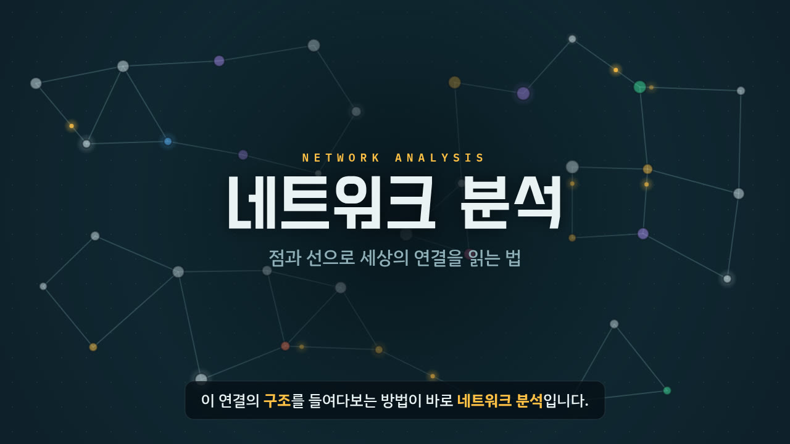
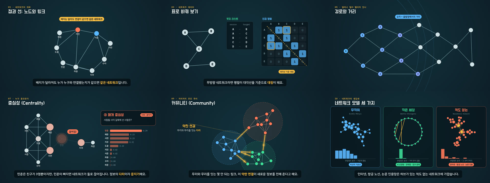

# 점과 선의 과학 — 네트워크 분석 입문 인터랙티브 영상

네트워크 분석에 꼭 필요한 개념과 원리를 **약 7분짜리 모션그래픽 영상**으로 쉽게 설명합니다.
영상은 브라우저에서 실시간으로 그려지기 때문에, 아무 때나 멈추고 화면 속 네트워크를 **직접 만져 볼 수 있습니다**.



## 바로 보기

| 방법 | 설명 |
| --- | --- |
| **`index.html` 더블클릭** | 저장소를 내려받아 `index.html`을 열면 끝. 설치도, 서버도 필요 없습니다. 인터넷이 없으면 글꼴만 기본 한글 글꼴로 바뀌어요. |
| **MP4 영상** | [`video/network-analysis.mp4`](video/network-analysis.mp4) — 1080p, 자막 포함, 장(chapter) 표시. 수업 자료나 유튜브용. 자막 원고는 [`video/network-analysis.srt`](video/network-analysis.srt). |
| **웹 주소로 공유** | 저장소 **Settings → Pages**에서 *Branch: `main` / `(root)`* 를 고르고 저장하면 `https://vadoro.github.io/network_tutorial/` 에서 열립니다. |
| **파일 하나로 공유** | `node tools/build-standalone.cjs` → `dist/network-analysis.html` 한 파일에 모든 것이 들어갑니다. 메일·메신저로 보내기 좋아요. |

## 무엇을 배우나요

| 장 | 시각 | 내용 | 영상 속에서 직접 해 보기 |
| --- | --- | --- | --- |
| 00 시작하며 | 0:00 | 세상은 연결로 가득하다 — 친구, 지하철, 웹, 논문 인용 | |
| 01 노드와 링크 | 0:21 | 점(대상)과 선(관계), 배치가 달라도 연결이 같으면 같은 네트워크 | 노드 끌어 옮기기 |
| 02 방향과 가중치 | 0:46 | 무방향 · 방향 · 가중 네트워크 | 화살표/굵기 켜고 끄기 |
| 03 엣지 리스트와 인접 행렬 | 1:12 | 네트워크를 표로 바꾸는 두 방법, 행렬의 대칭 | 행렬 칸 클릭해 링크 바꾸기 |
| 04 연결정도와 허브 | 1:42 | degree, 허브, 연결정도 분포, in/out-degree | 노드 클릭해 이웃 보기 |
| 05 경로와 거리 | 2:17 | 경로, 최단 경로, 너비 우선 탐색, 지름, 평균 경로 길이, 여섯 단계 분리 | 두 노드 골라 최단 경로 보기 |
| 06 밀도 | 2:51 | 실제 링크 ÷ 가능한 링크, 큰 네트워크는 듬성듬성 | 가능한 링크 켜고 끄기, 노드 수 바꾸기 |
| 07 중심성 | 3:18 | 연결정도 · 근접 · 매개 · 아이겐벡터 중심성 (크랙하트의 연 네트워크) | 지표 바꾸기, 사람을 빼 보기 |
| 08 군집 계수 | 4:24 | 내 친구들끼리도 친구일까? 삼각형 | 친구 쌍 켜고 끄기 |
| 09 커뮤니티 | 4:52 | 라벨 전파로 무리 찾기, 모듈성, 약한 연결의 힘 | 노드 끌기, 색칠 과정 다시 보기 |
| 10 세 가지 네트워크 모델 | 5:25 | 무작위 · 작은 세상 · 척도 없는 네트워크와 연결정도 분포 | 새 난수로 다시 만들기 |
| 11 분석은 이렇게 | 6:01 | 질문 → 정의 → 데이터 → 시각화·지표 → 해석, NetworkX 코드 | |
| 12 정리 | 6:31 | 배운 개념들을 하나의 개념 지도(이 역시 네트워크!)로 | 이름표 끌기 |



영상 아래에는 세 가지가 더 있습니다.

- **놀이터** — 클릭으로 노드와 링크를 만들면 밀도, 지름, 군집 계수, 네 가지 중심성, 커뮤니티와 모듈성이 즉시 다시 계산됩니다. 예제(연 네트워크, 별, 고리, 무작위, 작은 세상, 척도 없는 네트워크 등)를 불러오거나, **내 엣지 리스트(CSV)를 붙여 넣어** 그려 볼 수도 있어요.
- **퀴즈** — 열 문제. 객관식과 "매개 중심성이 가장 높은 노드를 클릭하세요" 같은 그림 문제가 섞여 있고, 바로 해설이 나옵니다.
- **용어집** — 모든 개념의 한 줄 정의와 공식.

### 플레이어 조작

| 키 | 동작 |
| --- | --- |
| 스페이스 | 재생 / 일시정지 |
| ← → | 5초 뒤로 / 앞으로 |
| Shift + ← → | 이전 장 / 다음 장 |
| C | 자막 켜기 / 끄기 |
| F | 전체 화면 |

- **음성 해설** 버튼을 켜면 브라우저에 내장된 음성(TTS)이 자막을 읽어 줍니다. 음성이 다 읽을 때까지 영상이 기다려 줘요.
- 화면을 클릭하거나 오른쪽 **직접 해 보기** 패널을 조작하면 영상이 잠시 멈춥니다. ▶ 재생을 누르면 원래 흐름으로 돌아가요.
- 주소 끝에 `#c-장면이름`을 붙이면 그 장면부터 시작합니다. 예: `index.html#c-centrality`

## 영상 속 숫자는 진짜 계산값입니다

중심성, 밀도, 모듈성 등은 `assets/js/core.js`에 구현한 알고리즘(너비 우선 탐색, Brandes 매개 중심성, 거듭제곱법 아이겐벡터 중심성, 라벨 전파, 모듈성 등)으로 실제 계산한 값이며, NetworkX 결과와 같습니다. 직접 확인해 보세요.

```bash
pip install networkx
python examples/basic_metrics.py                              # 영상 속 예제 다시 계산
python examples/basic_metrics.py examples/friends_edges.csv   # 내 CSV 분석
```

## 폴더 구조

```
index.html                 페이지 (영상 플레이어 · 놀이터 · 퀴즈 · 용어집)
assets/css/style.css       페이지 디자인 (밝은/어두운 테마)
assets/js/core.js          유틸리티와 그래프 알고리즘
assets/js/draw.js          캔버스 그리기 도우미 (노드, 링크, 자막, 아이콘)
assets/js/scenes-a.js      장면 00~06
assets/js/scenes-b.js      장면 07~12
assets/js/player.js        타임라인, 컨트롤, 자막, 음성 해설, 렌더 모드
assets/js/playground.js    놀이터
assets/js/quiz.js          퀴즈
examples/                  NetworkX 예제 코드와 CSV
tools/render-video.cjs     MP4로 내보내기
tools/build-standalone.cjs 파일 하나짜리 HTML 만들기
video/                     렌더링한 MP4와 자막 원고(SRT)
docs/                      README 그림
```

## 영상 다시 만들기 (MP4)

장면을 고쳤다면 MP4도 다시 뽑을 수 있습니다. [Node.js](https://nodejs.org/)와 [ffmpeg](https://ffmpeg.org/)가 필요합니다.

```bash
npm install
npx playwright install chromium
npm run render            # → video/network-analysis.mp4, video/network-analysis.srt (1920×1080, 30fps)
npm run render:preview    # 빠른 미리보기 (1280×720, 24fps)
node tools/render-video.cjs --from 198 --to 264 --out video/centrality.mp4   # 원하는 구간만
```

`index.html?render`로 열면 플레이어가 렌더 모드가 되어, 정해진 시각의 장면을 그대로 그립니다. 모든 난수는 시드가 고정되어 있어 같은 시각이면 항상 같은 그림이 나옵니다.

## 장면 고치기 · 추가하기

장면 하나는 `NA.scenes`에 넣는 객체 하나입니다.

```js
scene({
  id: 'density',                       // 주소 #c-density 로 바로 가기
  chapter: '밀도',                      // 목차 이름
  kicker: '06 · 얼마나 촘촘한가', title: '밀도 (Density)',
  dur: 27,                             // 길이(초)
  captions: [[0.4, '…**밀도**(density)입니다.'], [5, '…']],   // **굵게** = 강조색
  init() { return { /* 미리 계산해 둘 상태 */ }; },
  draw(g, t, S, env) { /* t초일 때의 화면을 그림 */ },
  click(S, hit, env) { /* 화면 클릭 처리 (선택) */ },
  panel: { html: '…', bind(el, S, player) { /* '직접 해 보기' 패널 */ } },
});
```

`draw`는 같은 `t`에 항상 같은 그림을 그리도록 작성합니다. 그래야 영상을 앞뒤로 넘기거나 MP4로 렌더링할 때 정확히 같은 장면이 나옵니다. 화면 좌표는 1280×720 기준이고, 실제 크기에 맞춰 자동으로 늘어납니다.
