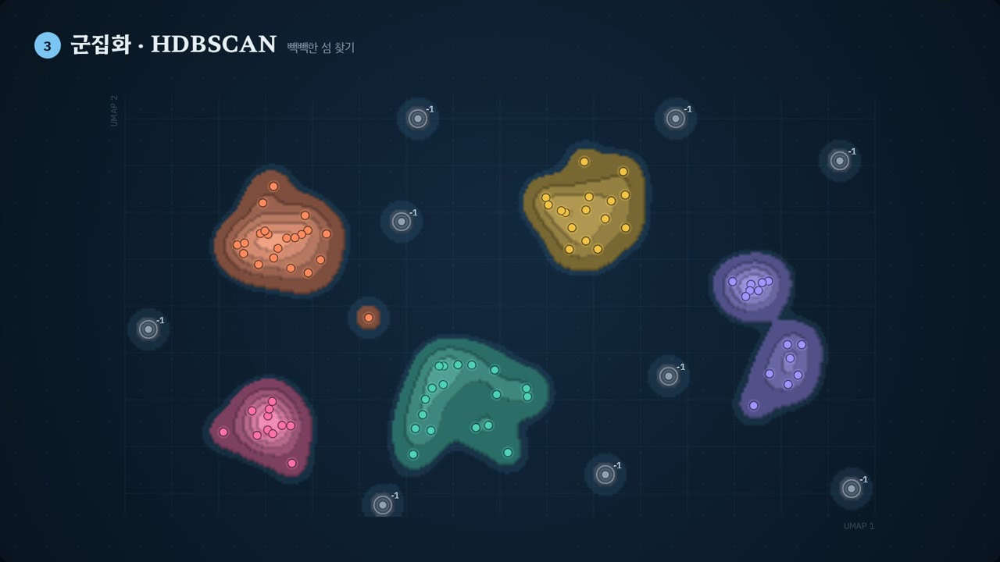

# DH 튜토리얼

디지털 인문학 연구에 쓰는 데이터 분석 방법을 **짧은 인터랙티브 모션그래픽 영상**으로 설명하는 튜토리얼 모음입니다.
영상은 아무 때나 멈추고 화면 속 데이터를 직접 바꿔 볼 수 있고, 영상 아래에는 놀이터·퀴즈·용어집이 이어집니다.



## 튜토리얼

| 튜토리얼 | 분야 | 길이 | 내용 |
| --- | --- | --- | --- |
| [점과 선의 과학](network-analysis/) | 네트워크 분석 | 6:57 · 13장면 | 노드와 링크, 방향·가중치, 엣지 리스트와 인접 행렬, 연결정도, 경로와 거리, 밀도, 네 가지 중심성, 군집 계수, 커뮤니티, 세 가지 네트워크 모델, 분석 흐름 |
| [BERTopic 토픽 지도](bertopic/) | 토픽 모델링 | 3:46 · 9장면 | 문장 임베딩, UMAP 차원 축소, HDBSCAN 군집화, c-TF-IDF 토픽 이름, 결과 읽기, 부품 바꿔 끼우기 |

모든 튜토리얼에 자막과 음성 해설, 장면별 '직접 해 보기', 놀이터, 퀴즈, 용어집, 수업용 MP4 영상이 있습니다.

## 보는 방법

- **웹 주소**: 저장소 **Settings → Pages**에서 *Deploy from a branch* → `main` / `(root)`를 고르면 `https://vadoro.github.io/dh_tutorials/` 에서 열립니다.
- **내 컴퓨터에서**: 저장소를 내려받아 맨 위의 `index.html`을 더블클릭하세요. 설치할 것이 없고, 인터넷이 없으면 글꼴만 기본 한글 글꼴로 바뀝니다.
- **영상 파일**: 각 튜토리얼의 `video/` 폴더에 1080p MP4가 있습니다.

## 구조

```
index.html              사이트 첫 화면 (튜토리얼 카드 목록)
assets/catalog.js       튜토리얼 목록 — 새 튜토리얼은 여기에 한 항목 추가
assets/site-bar.js      각 튜토리얼 위에 붙는 공통 상단 바
assets/site.css         사이트 페이지 디자인
network-analysis/       점과 선의 과학 (네트워크 분석)
bertopic/               BERTopic 토픽 지도 (토픽 모델링)
CLAUDE.md               새 튜토리얼을 만들 때 지킬 규칙과 확인 목록
```

튜토리얼마다 폴더 안에서 완결됩니다. 각 폴더의 README에 장면 구성, 조작법, 영상 다시 만드는 법이 있어요.

## 튜토리얼 추가하기

1. `<slug>/index.html`을 만들고 `<body>` 바로 다음에 공통 상단 바를 넣습니다.
2. `assets/catalog.js`에 항목을 추가하고, `<slug>/docs/poster.jpg` 미리보기를 둡니다.
3. 이 README의 표에 한 줄을 추가합니다.

자세한 규칙(장면 형식, 음성 해설 동작, 퀴즈·용어집 형식, 영상 렌더링, 확인 목록)은 [CLAUDE.md](CLAUDE.md)에 있습니다.

## 기록

`network-analysis/`와 `bertopic/`은 원래 `vadoro/network_tutorial`, `vadoro/bertopic_tutorial` 저장소였습니다. `git subtree`로 옮겨서 예전 커밋 기록이 그대로 남아 있습니다.
